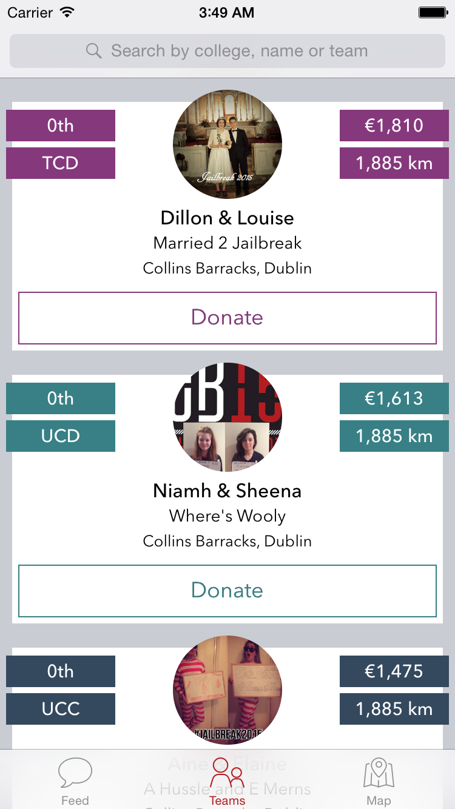

Jailbreak iOS App
================

## Screenshots
<table>
  <tbody>
    <tr>
      <td></td>
      <td></td>
    </tr>
    <tr>
      <td></td>
      <td></td>
    </tr>
    <tr>
      <td></td>
    </tr>
  </tbody>
</table>

## Installing Dependencies

[**CocoaPods**](http://cocoapods.org/) will handle all the work for us.  
First install it by typing into terminal:

```bash
sudo gem install cocoapods
```

Then in terminal `cd` to the project folder (were .xcodeproj is) and run:

```bash
pod install
```

Update existing frameworks by running:

```bash
pod update
```

***NOTE: You MUST open .xcworkspace instead of .xcodeproj from now on.***
